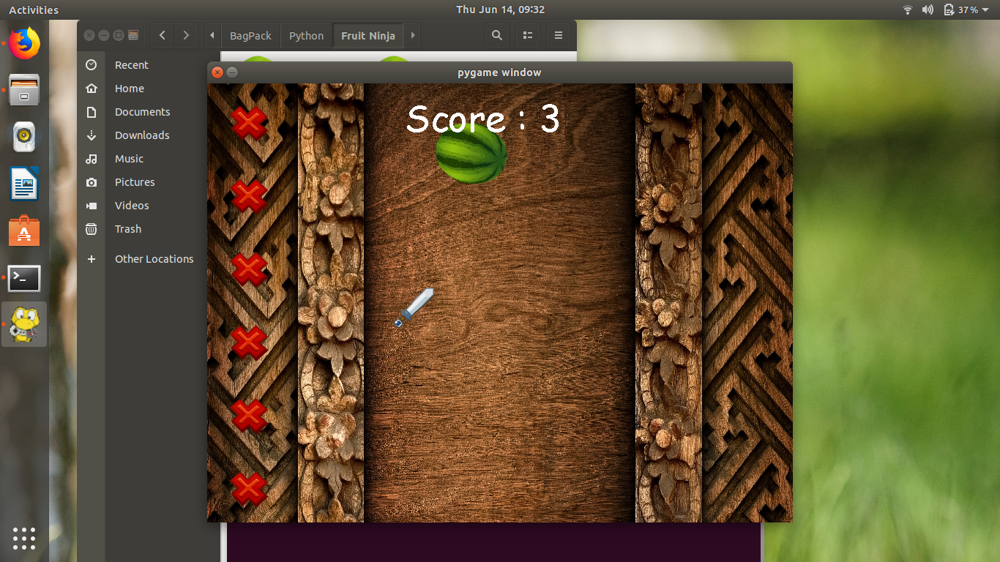
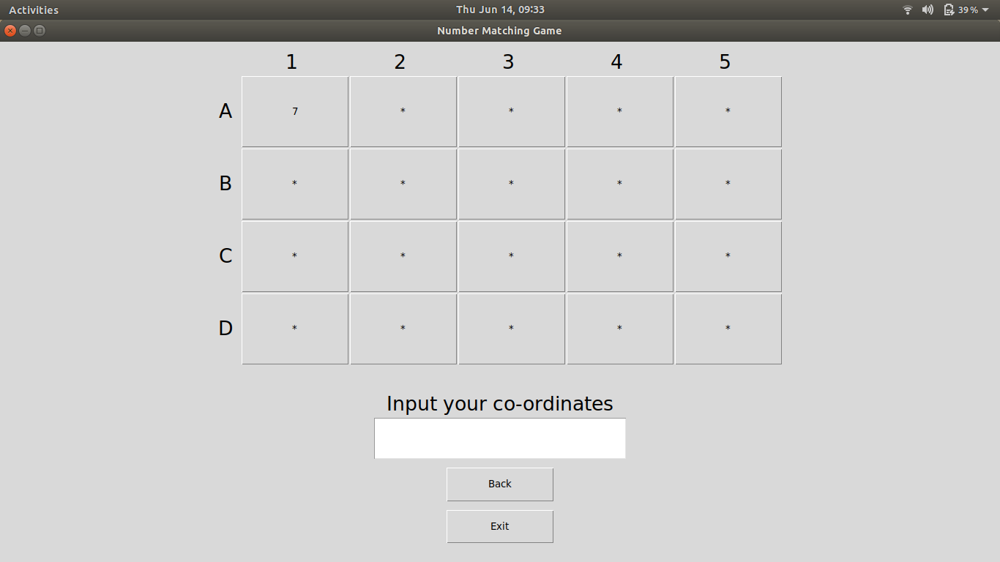
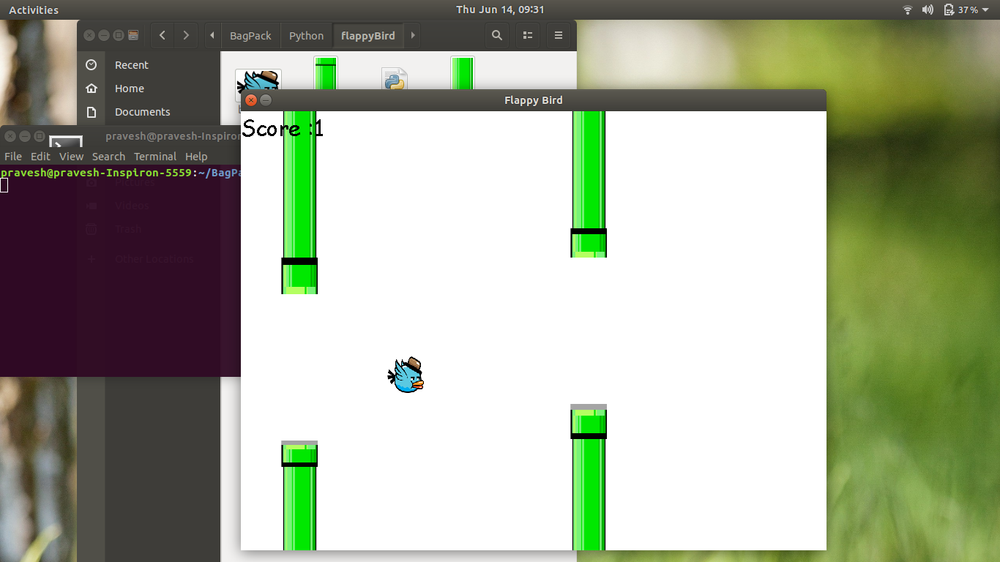
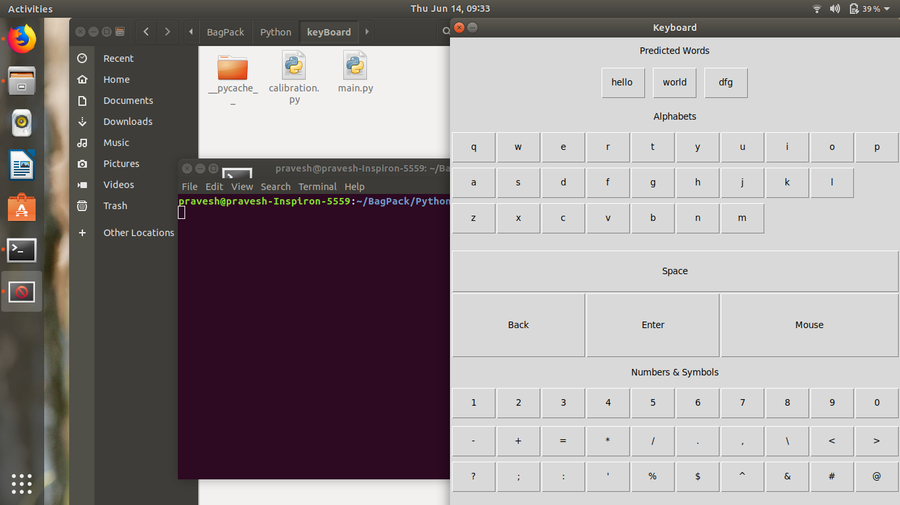
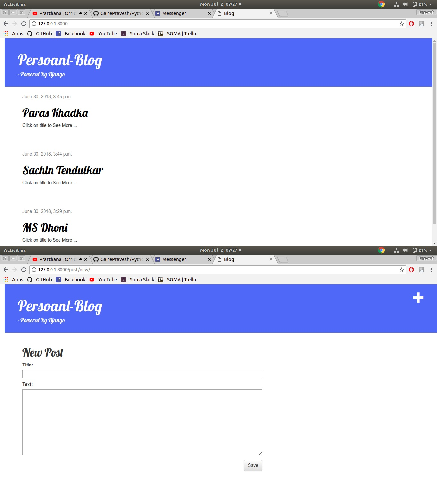
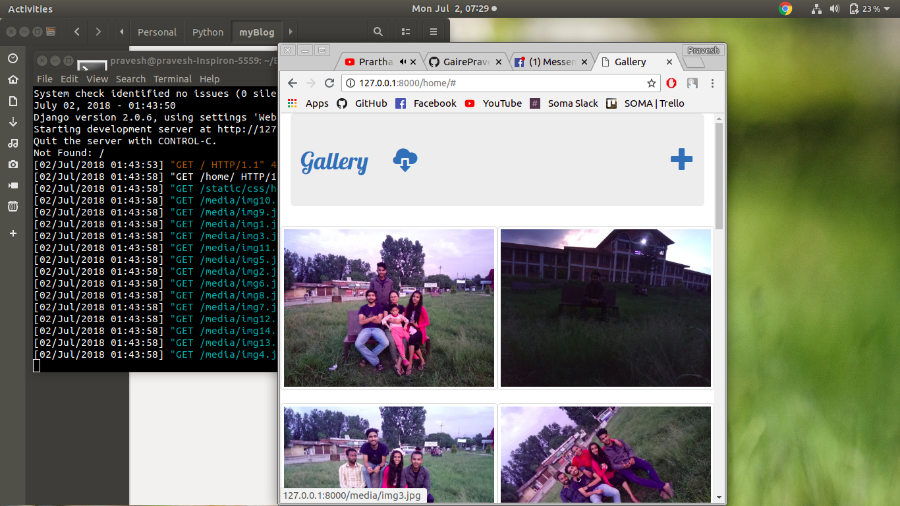

# Personal-Practise 
Contains different small projects made for learning different libs of python 

* MazeSolver using recursion 
* Babyname Exractor from web using Regex  
* Calculator using tkinter 
* gcode x and y co-ordinate extractor using regex 
* spreadsheet row column converter  
* Download all the mp4 from a website 
* Snow-Boy Hotword Detection  
* Cricket Score  
* Cornway's Game of Life  
* Fruit Ninja
* Number Matching Game
* Smart - Flappy
* Screen Keyboard
* A Personal Blog Prototype using django
* A LAN Gallery to share photos using django server
    
    
    
    
    
    
    
    
