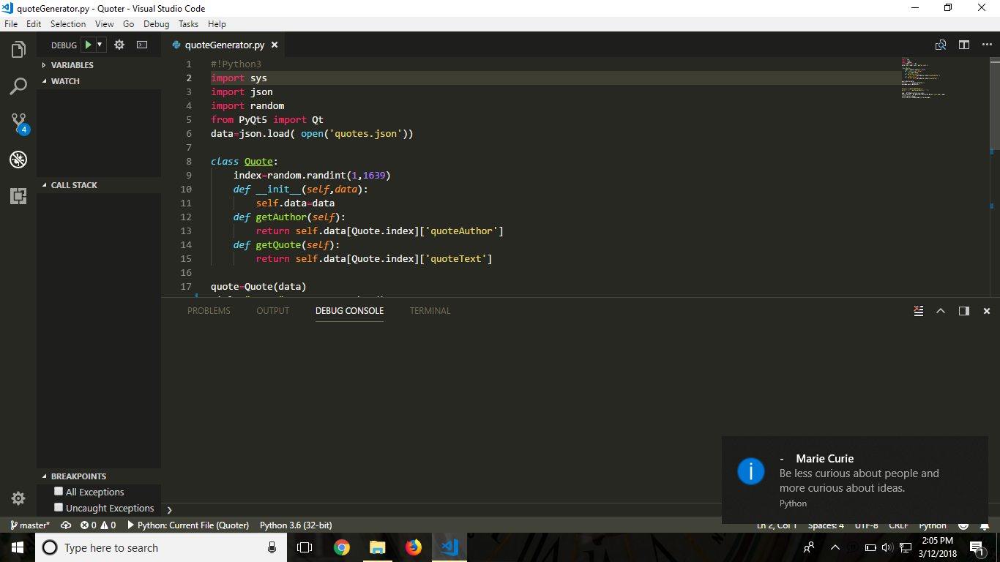

<h1> Quoter</h1> 
Extracts a random quote from quotes.json and pyQt5 displays it in windows notification bar. 

Made it automatically run every 15 minutes in my PC by using Task Sheduler. 

In Task Sheduler: 
* In General, tick the checkbox- Run with highest provileges. 
* In Triggers, set the required settings for you. 
* In Actions, set the Program/script to the path of .exe, Add arguments should be name of python script(i.e quoteGenerator.py) and Start in should be location of the python script. 
 
.py to .exe made using cx_Freeze. 

To create .exe create a setup.py and type:  
python setup.py build  

Enjoy Random Motivational Quotes! 

